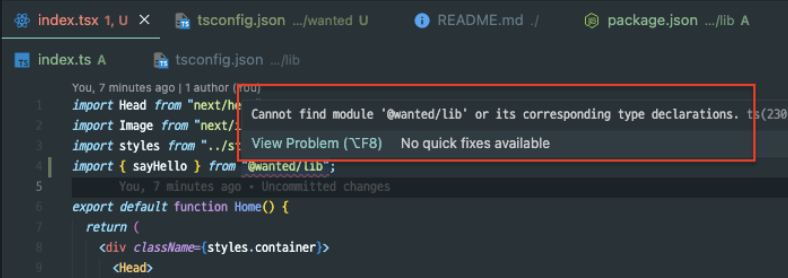

# yarn berry 실습

### 1. 버전 확인

```js

mkdir 프로젝트명 // 프로젝트 생성.

cd 프로젝트명 // 프로젝트 디렉토리로 이동한다.

yarn -v // yarn 버전 확인


둘중에 하나로 setting 해준다. 실습에선 berry를 사용.
yarn set version berry // yarn 버전 변경 (3.3.0 === berry)
yarn set version stable

// yarn 버전 확인
yarn -v (3.3.0 인지 확인한다.)

```

<br>

### 2. 프로젝트 초기화

```js
yarn init -w

// 이것저것 파일이 생긴다. (.yarn, .editorconfig, yarnrc.yml, package.json, yarn.lock)
```

<br>

### 3. workspace 설정

```js

// 생성된 파일 중 package.json을 열어보면 아래의 코드가 생겼다.

// workspaces에 apps라는 workspace 추가.
{
  "name": "mono",
  "packageManager": "yarn@3.3.0",
  "private": true,
  "workspaces": [
    "apps/*", //
    "packages/*"
  ]
}
```

packages는 기본 생성된 workspace,
apps를 추가해줬다.

여기서 중요한 점은, package에서 변경이 있으면 루트에서 yarn 다시 해줘야됨.


<br>

### 4. apps 폴더에 create next-app 프로젝트 추가

```js

cd apps // apps 디렉토리로 이동

yarn create next-app //next app 생성.

// 생성된 next app의 pacakge.json 수정
// root/apps/nextapp/package.json
{
  "name": "@harry/nextapp", // @harry 붙여 수정함.
  "version": "0.1.0",
  "private": true,
  "scripts": {
    "dev": "next dev",
    "build": "next build",
    "start": "next start",
    "lint": "next lint"
  },
  "dependencies": {
    "@types/node": "18.11.11",
    "@types/react": "18.0.26",
    "@types/react-dom": "18.0.9",
    "eslint": "8.29.0",
    "eslint-config-next": "13.0.6",
    "next": "13.0.6",
    "react": "18.2.0",
    "react-dom": "18.2.0",
    "typescript": "4.9.3"
  }
}


cd ../../ //루트로 이동
yarn // 상태 갱신하기
yarn workspace @harry/nextapp run dev // 실행 확인.
// 이처럼 실행하지않고 @harry/nextapp 디렉토리로 이동해서 yarn dev로 실행할수도 있지만, 그러면 의미없음.

```

프로젝트명에 @harry를 붙여줬다.<br>
루트에서나 다른 워크스페이스에서 nextapp에 접근할 때<br>
같은 이름을 가진 외부 라이브러리나 파일과 중복될 수 있어서라고 함.

<br>

### 5. packages 폴더에 lib/src 폴더 생성.

```js

cd packages/lib // 이동

yarn init

// package.json 생긴다.
{
  "name": "@harry/lib", //  이름 수정해준다.
  "packageManager": "yarn@3.3.0"
}

cd src // 디렉토리로 이동

index.tsx 만든다.
그 안에 "hello from lib"을 반환하는 함수를 만들어 export 했다.

export const sayHello = () => {
  console.log("hello from lib");
  return "hello from lib";
};

// typescript를 설치한다.
cd .. // 루트로 이동해서
yarn workspace @harry/lib add typescript -D

package에 변경을 했으니 다시 루트에서 초기화.
cd ..
cd ..
yarn

```

<br>

### 6. nextapp 워크스페이스에서 lib를 가져와 사용한다.

```js

// root 디렉토리에서

yarn workspace @harry/nextapp add @harry/lib
```


apps/nextapp/package.json에<br>
@harry/lib이 주입된 것을 볼 수 있다.

```js
// ~nextapp/pages/index.tsx

import Head from "next/head";
import Image from "next/image";
import styles from "../styles/Home.module.css";
import { sayHello } from "@harry/lib"; //임포트해서

export default function Home() {
  return (
    <div className={styles.container}>
      <Head>
        <title>Create Next App</title>
        <meta name="description" content="Generated by create next app" />
        <link rel="icon" href="/favicon.ico" />
      </Head>
      <h2>{sayHello()}</h2> // 사용
    </div>
  );
}
```

안된다. !<br>

```js

// lib/package.json에 설정이 덜 됨.
{
  "name": "@harry/lib",
  "packageManager": "yarn@3.3.0",
  "main": "src/index.ts", // 추가 !!
  "devDependencies": {
    "typescript": "^4.9.3"
  }
}

```

위에서 package 변경이 있었어서,<br>
갱신하고 실행해보자.

```js
cd ../../ //루트로 이동
yarn // 상태 갱신하기

yarn workspace @harry/nextapp run dev
-> 잘 실행됨.
```

<br>

---

### typescript error 발생

`apps/nextapp/pages/index.tsx`를 열어보면 typescript error가 발생.

yarn berry는 npm과 모듈을 불러오는 방식이 다르기 때문이라고 함.

```js
// root directory 에서

yarn add -D typescript
yarn dlx @yarnpkg/sdks vscode

```

<br>

### arcanis.vscode-zipfs

yarn PnP 사용을 위한 vscode extension 설치<br>
ZipFS - a zip file system

.vscode/extensions.json에 추가


<br>

### pacakges/lib 만들어 apps/harry에서 사용해 보기!

지금까지 과정으로 실습했을때 에러없이 잘 작동함.

1. @harry/nextapp에 @harry/lib 의존성이 잘 들어가 있고,
2. nextapp에서 lib에서 export한 sayHello함수가 잘 작동함.

`그러나 path로 에러가 있을 수 있다고 한다 !!`



모듈을 찾지 못하는 에러인데 tsconfig에서 path 설정으로 해결할 수 있다.

```js
{
  "$schema": "https://json.schemastore.org/tsconfig",
  "compilerOptions": {
    ...
    "paths": {
      "@harry/lib": ["../../packages/lib/src/index"]
    }
  },
  "include": ["next-env.d.ts", "**/*.ts", "**/*.tsx"],
  "exclude": ["node_modules"]
}
```

<br>

## etc

- `breaking change`가 있어서나 변경사항이 있어서 프로젝트 버전이 바뀔때 `learna`는 자동으로 버전을 관리해준다고 함.

- pnp를 사용하지 않는법 - node linker를 사용할 수 있다. 이미지 참고.
  

- 터미널을 처음 켠 상태에서 바로 yarn set version berry로 버전을 설정하고<br> 프로젝트를 실습했을때, 기존 가지고 있던 다른 프로젝트에서 yarn start 시 에러가 나는 이슈가 있었는데,<br> yarn install을 해보라고 하지만 dependency 꼬일까봐 하지않았다.

그냥 다시 터미널 켜서
yarn set version 1.22.19 로 원복하고<br>
프로젝트 내에서 berry로 설정함.

실습할 프로젝트 디렉토리로 이동해서 yarn 버전을 설정해주고<br> 전역은 yarn 1.22.19? 버전으로 유지하는게 좋은 듯.
